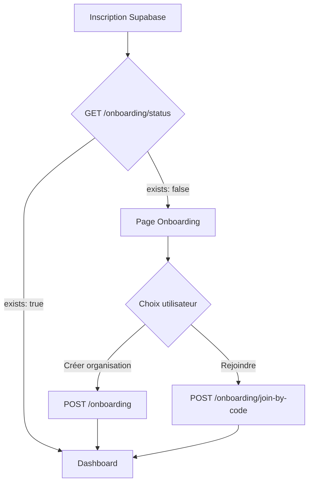

# 📚 DataFriday API - Guide d'intégration Frontend

## 🔗 URL de Base

| Environnement | URL |
|---------------|-----|
| Development | `http://localhost:3001/api/v1` |
| Staging | `https://api-staging.datafriday.io/api/v1` |
| Production | `https://api.datafriday.io/api/v1` |

## 📖 Documentation Interactive

**Swagger UI** disponible à : `http://localhost:3001/docs`

---

## 🔐 Authentification

### Flux d'authentification

```
1. Utilisateur se connecte via Supabase Auth
2. Supabase retourne un JWT token
3. Frontend stocke le token
4. Chaque requête API inclut le header Authorization
```

### Headers requis

```javascript
headers: {
  'Authorization': `Bearer ${supabaseToken}`,
  'Content-Type': 'application/json'
}
```

### Configuration Axios recommandée

```javascript
// lib/api.js
import axios from 'axios'
import { supabase } from './supabase'

const api = axios.create({
  baseURL: import.meta.env.VITE_API_URL || 'http://localhost:3001/api/v1',
  timeout: 30000,
})

// Intercepteur pour ajouter le token automatiquement
api.interceptors.request.use(async (config) => {
  const { data: { session } } = await supabase.auth.getSession()
  if (session?.access_token) {
    config.headers.Authorization = `Bearer ${session.access_token}`
  }
  return config
})

// Intercepteur pour gérer les erreurs
api.interceptors.response.use(
  (response) => response,
  (error) => {
    if (error.response?.status === 401) {
      // Token expiré, rediriger vers login
      window.location.href = '/login'
    }
    return Promise.reject(error)
  }
)

export default api
```

---

## 🚀 Endpoints

### Health Check (Public)

#### `GET /health`
Vérifie le status de l'API.

**Response 200:**
```json
{
  "status": "ok",
  "message": "API is running",
  "timestamp": "2025-01-01T00:00:00.000Z",
  "version": "1.0.0"
}
```

---

### Onboarding (Auth Supabase requise)

Ces endpoints nécessitent uniquement un token Supabase valide, pas de tenant.

#### `GET /onboarding/status`
Vérifie si l'utilisateur existe en base de données.

**Response 200:**
```json
{
  "exists": false,
  "hasOrganization": false,
  "user": null,
  "tenant": null
}
```

Ou si l'utilisateur existe:
```json
{
  "exists": true,
  "hasOrganization": true,
  "user": {
    "id": "uuid",
    "email": "user@example.com",
    "firstName": "Jean",
    "lastName": "Dupont",
    "role": "ADMIN"
  },
  "tenant": {
    "id": "uuid",
    "name": "Mon Organisation",
    "slug": "mon-organisation",
    "plan": "FREE",
    "status": "ACTIVE"
  }
}
```

---

#### `POST /onboarding`
Crée une nouvelle organisation et associe l'utilisateur comme propriétaire.

**Body:**
```json
{
  "firstName": "Jean",
  "lastName": "Dupont",
  "organizationName": "Mon Restaurant",
  "organizationType": "Restaurant",
  "organizationEmail": "contact@monrestaurant.fr",
  "organizationPhone": "+33612345678",
  "siret": "12345678901234",
  "address": "123 Rue de Paris",
  "city": "Paris",
  "postalCode": "75001",
  "country": "France"
}
```

**Response 201:**
```json
{
  "tenant": {
    "id": "uuid",
    "name": "Mon Restaurant",
    "slug": "mon-restaurant",
    "plan": "FREE",
    "status": "TRIAL",
    "invitationCode": "ABC12345"
  },
  "user": {
    "id": "uuid",
    "email": "user@example.com",
    "firstName": "Jean",
    "lastName": "Dupont",
    "role": "ADMIN"
  }
}
```

**Erreurs:**
- `400` - Données invalides
- `409` - Slug déjà utilisé

---

#### `POST /onboarding/join-by-code`
Rejoint une organisation existante via un code d'invitation.

**Body:**
```json
{
  "invitationCode": "ABC12345",
  "firstName": "Marie",
  "lastName": "Martin"
}
```

**Response 201:**
```json
{
  "message": "Successfully joined organization",
  "tenant": {
    "id": "uuid",
    "name": "Mon Restaurant",
    "slug": "mon-restaurant",
    "plan": "FREE",
    "status": "ACTIVE"
  },
  "user": {
    "id": "uuid",
    "email": "marie@example.com",
    "firstName": "Marie",
    "lastName": "Martin",
    "role": "STAFF"
  }
}
```

**Erreurs:**
- `400` - Code d'invitation requis
- `404` - Code invalide ou expiré
- `409` - Utilisateur déjà membre d'une organisation

---

### Profil Utilisateur (Auth + Tenant requis)

#### `GET /me`
Obtient le profil de l'utilisateur connecté.

**Response 200:**
```json
{
  "id": "uuid",
  "email": "user@example.com",
  "firstName": "Jean",
  "lastName": "Dupont",
  "role": "ADMIN",
  "tenantId": "uuid",
  "tenant": {
    "id": "uuid",
    "name": "Mon Restaurant",
    "slug": "mon-restaurant",
    "plan": "FREE",
    "status": "ACTIVE"
  }
}
```

**Erreurs:**
- `401` - Non authentifié
- `404` - Utilisateur non trouvé (nécessite onboarding)

---

## 📱 Exemples d'intégration Frontend

### Store Auth (Pinia)

```javascript
// stores/auth.js
import { defineStore } from 'pinia'
import { ref, computed } from 'vue'
import { supabase } from '@/lib/supabase'
import api from '@/lib/api'

export const useAuthStore = defineStore('auth', () => {
  const user = ref(null)
  const token = ref(null)
  const dbUser = ref(null)
  const needsOnboarding = ref(false)
  
  const isAuthenticated = computed(() => !!token.value && !!user.value)
  const hasDbUser = computed(() => !!dbUser.value)

  async function checkDbUser() {
    try {
      const { data } = await api.get('/onboarding/status')
      if (data.exists) {
        dbUser.value = data.user
        needsOnboarding.value = false
      } else {
        dbUser.value = null
        needsOnboarding.value = true
      }
      return data
    } catch (e) {
      needsOnboarding.value = true
      return null
    }
  }

  async function login(email, password) {
    const { data, error } = await supabase.auth.signInWithPassword({ email, password })
    if (error) throw error
    
    token.value = data.session.access_token
    user.value = data.user
    await checkDbUser()
    
    return { needsOnboarding: needsOnboarding.value }
  }

  async function createOrganization(orgData) {
    const { data } = await api.post('/onboarding', orgData)
    dbUser.value = data.user
    needsOnboarding.value = false
    return data
  }

  async function joinByCode(invitationCode, firstName, lastName) {
    const { data } = await api.post('/onboarding/join-by-code', {
      invitationCode,
      firstName,
      lastName
    })
    dbUser.value = data.user
    needsOnboarding.value = false
    return data
  }

  return {
    user, token, dbUser, needsOnboarding,
    isAuthenticated, hasDbUser,
    checkDbUser, login, createOrganization, joinByCode
  }
})
```

### Router Guards

```javascript
// router/index.js
router.beforeEach(async (to, from, next) => {
  const authStore = useAuthStore()
  
  if (!authStore.initialized) {
    await authStore.checkAuth()
  }

  const isAuthenticated = authStore.isAuthenticated
  const needsOnboarding = authStore.needsOnboarding

  // Routes publiques
  if (to.meta.public) {
    return next()
  }

  // Redirection si non authentifié
  if (to.meta.requiresAuth && !isAuthenticated) {
    return next('/login')
  }

  // Redirection vers onboarding si nécessaire
  if (isAuthenticated && needsOnboarding && !to.meta.allowOnboarding) {
    return next('/onboarding')
  }

  next()
})
```

---

## ⚠️ Gestion des erreurs

### Format standard des erreurs

```json
{
  "statusCode": 400,
  "message": "Validation failed",
  "error": "Bad Request",
  "timestamp": "2025-01-01T00:00:00.000Z",
  "path": "/api/v1/onboarding"
}
```

### Codes d'erreur courants

| Code | Signification | Action |
|------|---------------|--------|
| 400 | Données invalides | Afficher les erreurs de validation |
| 401 | Non authentifié | Rediriger vers login |
| 403 | Accès refusé | Afficher message "accès non autorisé" |
| 404 | Ressource non trouvée | Afficher message ou rediriger |
| 409 | Conflit (doublon) | Informer l'utilisateur |
| 500 | Erreur serveur | Afficher message générique |

---

## 🔄 Flux d'onboarding complet



---

## 📞 Support

- **Documentation Swagger:** `http://localhost:3001/docs`
- **Email:** support@datafriday.io
